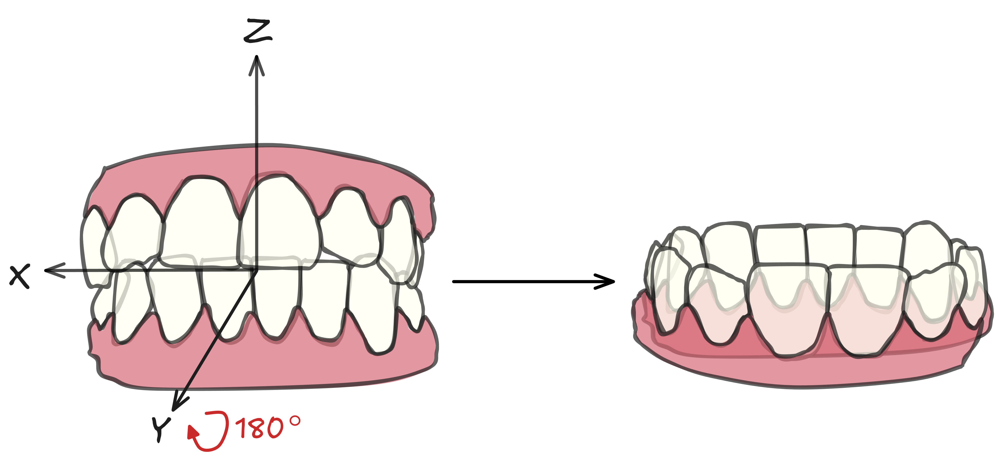

# 🦷​ Pointcept for Dental Landmark Prediction (WiP)

**Pointcept-Bracket** is a customized fork of [Pointcept](https://github.com/Pointcept/Pointcept), fine-tuned for **regression-based prediction of bracket installation points** on 3D data.  
This repository extends the original Pointcept framework with specialized components for regression tasks, evaluation, and visualization.

## 🚀 Key Features

- **IOS segmentation model**: model used to segment intra oral scans.

- **Custom Landmark Prediction model**: used to predict landmarks of interest of a 3D mesh by direct regression (each head outputs the coordinates of the coresponding point).

- **Custom Heatmap Prediction model**: used to predict dense heatmaps (one value for each point). You can aggregate per-vertex scores during inference to extract landmarks.

- **Full Integration with Pointcept**
  Retains compatibility with Pointcept’s modular design, dataloaders, and training utilities.

## 💻 Code
The following are the custom files used to implement the above cited models.
- **Models**:
  1) The segmentation model leverages the `DefaultSegmentorV2`, which is alredy implemented in pointcept.
  1) `pointcept/models/brackets/bracket_point_model.py` for the simple Landmark prediction model.
  2) `pointcept/models/brackets/bracket_heatmap_seg.py` for the Heatmap-based model. 
- **Config Files**: located at `configs/brackets/`, to experiment with various model variants.
- **Data Loaders**: 
  1) `brackets_semseg.py` used for the segmentator.
  2) `brackets.py` used for the simple Landmark Prediction model.
  3) `brackets_map.py` used for the Heatmap-based model.
- **Testers**: BracketTester_v2 and HeatmapTester inside `pointcept/models/brackets/bracket_heatmap_seg.py`.


## 📂 Data
The following is a brief explanation on how to structure your data to use our custom dataloader. 
### IOS segmentator:
  In the configuration file, the dataloader wants:
  + The **fold** file, which defines the train/validation/test splits. An example is available [here](assets/example_fold_segmentation.json). Currently, you must specify the fold using an absolute path in the configuration file. This will change soon: you’ll be able to select the fold directly from the command line when launching training or testing.


  + The **data_root**, which is the absolute path of the data folder.
    For each sample, the dataloader expects:
    1) The stl file of the scan. The filename must be STEM_lower/upper_ID.stl, for example STEM_lower_0001.stl.
    2) A json file with the same name of the scan. It must contain the list of per-point labels. Here you can find an [example](assets/example_mask.json).
    You can place all the stl-json pairs in your data root:
    ```bash
    IOS_data/
    ├─ STEM_lower_0001.stl
    ├─ STEM_lower_0001.json
    ├─ STEM_upper_0002.stl
    ├─ STEM_upper_0002.json
    ```

 The scans must be oriented as described [here](#-standard-orientation). As you can see, an extra 180 deg. rotation must be applied to the upper scan. This is done to ensure that the model is able to classify, for example, tooth 28 and 48 using the same label. The correct FDI index can be retrieved at inference time by just knowing if the original scan is either a "upper" or "lower" scan.
  Coordinate normalization (centering and scaling to unit sphere) is done online, so you don't need to preprocess your scans. Just make sure that the orientation is roughly the one that you see in the image.
  The model will use labels in the range [0,16], according to this mapping, where 0 is reserved for the gum: 

    ```python3
    self.default_mapping = {
        48: 1, 47: 2, 46: 3,
        45: 4, 44: 5, 43: 6,
        42: 7, 41: 8, 31: 9,
        32: 10, 33: 11, 34: 12, 
        35: 13, 36: 14, 37: 15,
        38: 16,
    }
    ```
### Landmark predictor:
The landmark predictor works on isolated tooth meshes, which can be extracted from the segmentation map of the full arch in the standard orientation without additional flips or rotations. Our **melted** dataset contains tooth meshes that are alredy normalized (centered and scaled to unit). If you don't pre-process your data this way, make sure to add the Normalization step directly in your pointcept configuration file. Also in this case you need to correctly setup:

+ The **fold** describing the train/test/validation splits. Here you can find an [example](assets/example_fold_bracket.json). In our setup each fold contains the teeth of a different subset of patients. If you name your fold file  ```fold_1.json```, ```fold_2.json```, ... you can directly set the fold to use with command line arguments (see [usage](##Usage)).

+ The data_root, which is the absolute path of the data folder. 
  For each sample, the data loader expects:
  1) The stl file of the single tooth, named STEM_lower/upper_ID_FDI_FDI, for example STEM_upper_10_FDI_22.stl.
  2) The JSON file containing the landmarks. An example is available [here](assets/example_landmarks.json). In our dataset, landmark coordinates are already normalized (after centering and scaling). We additionally provide two values(**translation** and **scaling**) which allow you to convert the landmarks back to the original coordinate space (e.g., for plotting or error evaluation in millimeters).
  3) If you want to train the **heatmap** based model, you also need the softlabels. They are .npy files with the same dimensionality as the input mesh (same number of vertices).

The standard directory structure is the following:
```bash
BracketsV1/
├─ block_1/
│  ├─ STEM_upper_10_FDI_22.stll
│  ├─ STEM_upper_10_FDI_22_softlabel.npy
│  ├─ STEM_upper_10_FDI_22.json
│  ├─ STEM_upper_10_FDI_23.stl
│  ├─ ...
├─ block_3/
│  ├─ ...
├─ fold_1.json
├─ fold_2.json
```
There are no substantial differences between block 1 and block 3 in our dataset. We haven't yet released block 2.

## 🧭 Standard Orientation 
<div align="center">
  
</div>

## 🔧 Installation
Follow the installation guide in the pointcept main branch.
Install the extra requirments specified in the `requirments.txt` file.

## 🔥 Usage
### Training
Example training command:
```bash
python tools/train.py --config-file configs/brackets/Pt_regressor.py --num-gpus 1 --options save_path=exp/brackets/debug data.train.fold=1 data.val.fold=1 data.test.fold=1
```

### Testing
Example testing command:
```bash
python tools/test.py --config-file /homes/mlugli/BracketPrediction/configs/brackets/Pt_regressor.py --options save_path=/homes/mlugli/BracketPrediction/exp/brackets/debug weight=/homes/mlugli/BracketPrediction/exp/brackets/debug/model/model_best.pth
```
## 🧰 Utils
Some files you can find usefull:
+ A python [script](generate_test_scripts.py) to generate slurm scripts for 5-fold cross validating multiple models;
+ A python [script](generate_train_script.py) to generate slurm scripts to launch testing for your trained models;
## 🐋 Production
WIP
